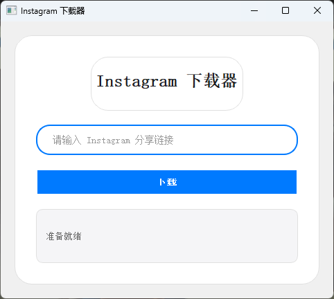
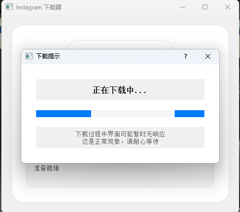

# Instagram Downloader Pro

<div align="center">
    
    <p>一款功能强大的 Instagram 媒体下载工具</p>
    <p>
        
        
        
        
        
        
    </p>
    <p>
        
        
    </p>
</div>

## ✨ 功能特性

- 📸 支持下载单张照片、视频、相册等多种媒体格式
- 🎯 支持批量下载用户公开媒体内容
- 🚀 简洁直观的现代化界面设计
- 💫 流畅的动画效果和操作反馈
- 📱 支持 Android 和 Windows 双平台
- 🔒 无需登录即可下载公开内容
- 📂 自定义下载目录
- 🌐 支持代理设置

## 📥 安装说明

### Windows 用户
1. 从 [Release](https://github.com/your-username/instagram-downloader/releases) 页面下载最新版本
2. 双击运行 `InstagramDownloader.exe`
## 📱 应用界面展示

<div align="center">
    
    
</div>

### Android 用户
1. 功能开发中……即将上线。

### 开发者安装
```bash
git clone https://github.com/your-username/instagram-downloader.git
cd instagram-downloader
pip install -r requirements.txt
```

## 🛠️ 核心依赖

- Python 3.7+
- Kivy/PyQt5 (UI框架)
- requests
- beautifulsoup4
- pillow
- instaloader

## 📖 使用指南

1. 启动应用程序
2. 将 Instagram 链接粘贴到输入框
3. 点击下载按钮
4. 等待下载完成

### 支持的链接类型

- 单张照片/视频帖子
- 多图相册帖子
- Stories
- Reels
- IGTV

## ⚙️ 高级设置

- 自定义下载目录
- 代理设置
- 下载质量选择
- 批量下载选项
- 文件命名规则

## 🔍 常见问题

<details>
<summary>应用支持下载私密账户内容吗？</summary>
不支持。本应用仅支持下载公开账户的媒体内容。
</details>

<details>
<summary>如何更改下载目录？</summary>
在设置页面中可以自定义下载目录路径。
</details>

<details>
<summary>下载失败怎么办？</summary>

1. 检查网络连接
2. 确认链接有效性
3. 尝试使用代理
4. 查看错误日志
</details>

## 📝 更新日志

### v1.0.0 (2024-03-05)

- 全新界面设计
- 支持 Android 平台
- 新增批量下载功能
- 优化下载性能

## 🔐 隐私声明

本应用不会收集任何个人信息，所有操作均在本地完成。

## 📜 许可证

本项目采用 MIT 许可证。

## ⚠️ 免责声明

本工具仅供学习和研究使用：

- 请遵守 Instagram 服务条款
- 尊重创作者版权
- 不得用于任何商业用途
- 开发者不对任何使用后果负责

## 🤝 贡献指南

欢迎提交 Issue 和 Pull Request！

1. Fork 本仓库
2. 创建特性分支
3. 提交变更
4. 发起 Pull Request

## 🌟 致谢

感谢所有贡献者的付出！

<div align="center">
    <b>如果觉得有帮助，请给个 Star ⭐</b>
</div>
